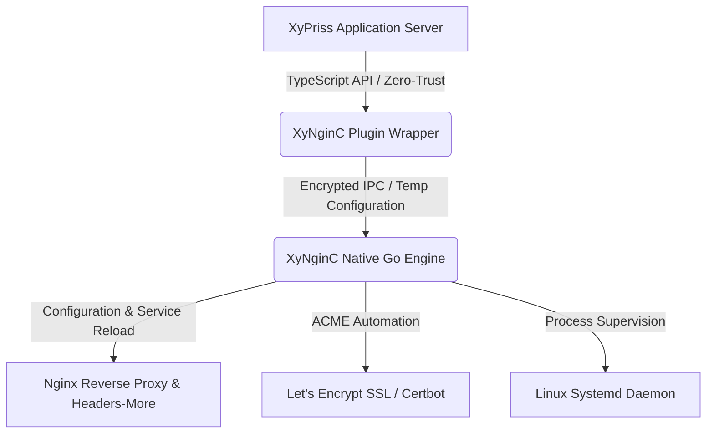

# XyNginC (XNCP)

XyPriss Nginx Controller (XNCP) is an enterprise-grade infrastructure controller providing automated reverse proxy configuration, Let's Encrypt SSL/TLS lifecycle management, and systemd service orchestration for the XyPriss web ecosystem.

[](https://www.npmjs.com/package/xynginc)
[](https://dll.nehonix.com/licenses/NOSL)
[](https://github.com/Nehonix-Team/xynginc/releases)

---

## 1. Architectural Overview

XyNginC eliminates manual web server configuration by bridging application-level declarations in XyPriss directly with Linux system-level primitives. The architecture is composed of two primary layers:

1. **TypeScript Controller Plugin**: Integrates into the XyPriss lifecycle, validates domain declarations, enforces security boundaries, and prevents execution conflicts in multi-tenant or multi-server topologies.
2. **Native Go Engine (`core-go`)**: A compiled binary that interacts directly with host system utilities (`nginx`, `certbot`, `ufw`, `systemd`). It executes operations with deterministic speed, zero runtime overhead, and strict isolation.



---

## 2. Core Capabilities

- **Automated Reverse Proxy**: Generates hardened Nginx virtual host declarations matching local application ports.
- **Automated TLS Lifecycle**: Manages certificate issuance and HTTP-01 challenge completion via Certbot without service interruption.
- **Production Hardening**: Implements CIS and OWASP-aligned configuration baselines, HTTP/2 termination, and connection pooling.
- **Header Obfuscation**: Integrates `libnginx-mod-http-headers-more-filter` to strip default web server identification tokens and enforce `Server: NEHONIX/XNCP`.
- **Systemd Process Supervision**: Provides one-command deployment to transform XyPriss applications into self-healing, auto-restarting systemd daemons.
- **Multi-Server Deduplication**: Synchronizes state across multiple sub-instances sharing identical domain configurations to prevent redundant Nginx reloads.
- **Firewall Integration**: Optionally verifies and provisions access rules on active Uncomplicated Firewall (UFW) configurations.

---

## 3. System Requirements & Compatibility

- **Operating System**: Linux (Ubuntu 22.04+, Debian 11+ recommended).
- **Architectures**: x86_64 (`amd64`), ARM64 (`aarch64`), x86 (`386`).
- **Runtimes**: Bun (v1.2+), Node.js (v18.0+).
- **Package Manager**: XFPM (XyPriss Fast Package Manager).

> [!IMPORTANT]
> XyNginC is designed specifically for Linux server environments in production. Windows and macOS are not supported for production deployments.

---

## 4. Installation

XyNginC is distributed through the official XyPriss registry using XFPM:

```bash
xfpm install xynginc
```

The package registers two CLI aliases in the workspace environment: `xynginc` and `xncp`.

---

## 5. Integration

### Basic Server Declaration

Register XyNginC within the server initialization pipeline:

```typescript
import { createServer } from "xypriss";
import XNCP from "xynginc";

const app = createServer({
  plugins: {
    register: [
      XNCP({
        domains: [
          {
            domain: "api.example.com",
            port: 8088,
            ssl: true,
            email: "ops@example.com",
            maxBodySize: "25M",
          },
          {
            domain: "auth.example.com",
            port: 8089,
            ssl: true,
            email: "ops@example.com",
          },
        ],
        installRequirements: true,
        autoReload: true,
        autoFixFirewall: true,
        sudoPassword: process.env.SUDO_PASSWORD,
      }),
    ],
  },
});

app.start();
```

---

## 6. Process Supervision & Service Management

XyNginC includes dedicated systemd management commands to ensure persistent execution, crash resilience, and automatic startup upon system boot.

### Service Deployment

From the root directory of your project:

```bash
sudo xfpmx xncp service install
```

The installer automatically:
1. Detects the execution runtime (`bun` or `node`).
2. Detects the project entrypoint (`src/server.ts`, `server.ts`, `dist/index.js`).
3. Discovers and binds the local `.env` configuration (`EnvironmentFile`).
4. Configures process execution under the non-root owner (`SUDO_USER` or `ubuntu`).
5. Enforces resource limits (`LimitNOFILE=65535`, `LimitNPROC=4096`).
6. Configures auto-restart policies (`Restart=always`, `RestartSec=5s`).
7. Enables and immediately launches the service unit via systemd.

### Service Operations

```bash
# List all services managed by XyNginC
xfpmx xncp service list               # or: xfpmx xncp services

# Display service status and Nginx health
xfpmx xncp service status [service-name]

# Follow live application log output
xfpmx xncp logs -f

# Restart, stop, or start service
sudo xfpmx xncp service restart [service-name]
sudo xfpmx xncp service stop [service-name]
sudo xfpmx xncp service start [service-name]

# Uninstall and deregister service unit
sudo xfpmx xncp service uninstall [service-name]
```

---

## 7. Command-Line Interface Reference

The CLI can be invoked globally as `xynginc` / `xncp` or locally via `xfpmx xncp`:

```bash
# Infrastructure Diagnostics & Setup
sudo xynginc check                     # Verify system dependencies
sudo xynginc install                   # Install missing system requirements

# Service Supervision
sudo xynginc service install [name]    # Provision and start systemd service
xynginc service list                   # List all managed background services (alias: services)
sudo xynginc service start [name]      # Start managed service
sudo xynginc service stop [name]       # Stop managed service
sudo xynginc service restart [name]    # Restart managed service
xynginc service status [name]          # Inspect unit status and reverse proxy state
xynginc service logs [name] -f         # Stream live service logs
sudo xynginc service uninstall [name]  # Remove service unit

# Direct Aliases
xynginc services                       # List all background services
xynginc logs -f                        # Stream logs of default service

# Virtual Host Management
sudo xynginc add --domain example.com --port 8080 --ssl --email ops@example.com
sudo xynginc remove example.com
sudo xynginc list

# Server Validation & Maintenance
sudo xynginc test                      # Validate current Nginx syntax
sudo xynginc reload                    # Safely reload Nginx configuration
sudo xynginc clean                     # Purge conflicting or broken virtual hosts
sudo xynginc restore <backup_id>       # Revert to a previous configuration backup
```

### Options for `service install`

| Parameter | Alias | Description | Default |
|---|---|---|---|
| `--name` | `-n` | Systemd service unit identifier | `name` in `package.json` |
| `--runtime` | `-r` | Absolute path to runtime binary | Auto-detected (`bun`/`node`) |
| `--entrypoint` | `-e` | Path to server bootstrap file | Auto-detected (`src/server.ts`...) |
| `--user` | `-u` | Linux system user for process execution | `SUDO_USER` / current user |
| `--env-file` | | Path to environment file | Auto-detected `.env` in directory |

---

## 8. TypeScript Plugin Options

```typescript
interface XyNginCDomainConfig {
  domain: string;           // Target host (e.g., "api.example.com")
  port: number;             // Local listener port
  ssl?: boolean;            // Enable Let's Encrypt TLS (default: false)
  email?: string;           // Registration email for ACME notifications
  maxBodySize?: string;     // Client request limit, e.g., "50M" (default: "10M")
}

interface XyNginCPluginOptions {
  domains: XyNginCDomainConfig[];
  installRequirements?: boolean; // Provision system dependencies if missing (default: false)
  autoReload?: boolean;          // Reload Nginx upon successful configuration (default: true)
  autoFixFirewall?: boolean;     // Provision UFW rules for 80/443 (default: false)
  sudoPassword?: string;         // Password for non-interactive privilege escalation
  binaryPath?: string;           // Custom path to xynginc Go binary
  autoDownload?: boolean;        // Automatically retrieve binary if not present (default: true)
  version?: string;              // Specific Go core release tag (default: "latest")
}
```

---

## 9. Programmatic Server API

When registered, XyNginC attaches management methods directly to `server.xynginc`:

```typescript
// Dynamically register a domain at runtime
await server.xynginc.addDomain(domain, port, ssl, email, maxBodySize);

// Unregister a domain and remove virtual host
await server.xynginc.removeDomain(domain);

// Query configured domain inventory
const domains: string[] = await server.xynginc.listDomains();

// Execute Nginx configuration test
const isSyntacticallyValid: boolean = await server.xynginc.test();

// Trigger safe service reload
await server.xynginc.reload();

// Retrieve aggregate infrastructure status
const summary: string = await server.xynginc.status();
```

---

## 10. Security & Compliance Specifications

- **Privilege Separation**: Application services execute strictly under unprivileged user accounts. Privilege escalation via `sudo` is scoped exclusively to configuration files and service reloads.
- **Secure File Passing**: Configurations are passed to the Go core via transient, restricted-permission files (`/tmp/.xynginc-config-*.json`) that are deleted immediately after parsing to prevent sensitive data leakage.
- **Signature Integrity**: Distributed with an official cryptographic manifest (`xypriss.plugin.xsig`) validated by the XyPriss runtime against unauthorized modification.
- **Network Boundaries**: Nginx reverse proxy templates restrict upstream listeners to loopback interfaces (`127.0.0.1`) by default, preventing direct public exposure of internal microservices.

---

## 11. License

This software is licensed under the **NEHONIX Open Source License (NOSL) v1.0**.  
Copyright © 2025-2026 [NEHONIX](https://www.nehonix.com). All rights reserved.
