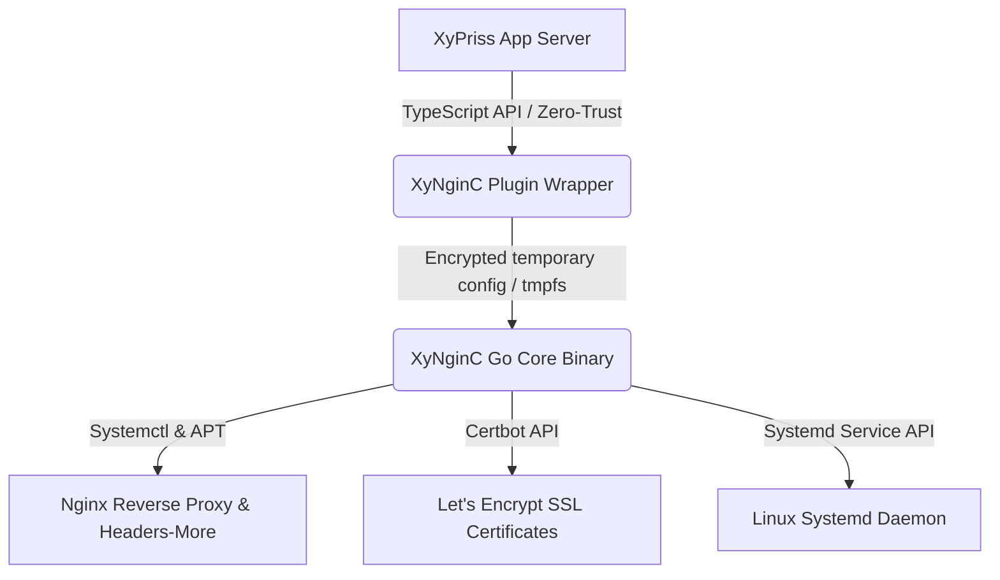

# XyNginC (XNCP)

> **XyPriss Nginx Controller** — Automated Nginx reverse proxy, automated Let's Encrypt SSL, and production systemd background service management for the XyPriss ecosystem.

[](https://www.npmjs.com/package/xynginc)
[](https://dll.nehonix.com/licenses/NOSL)
[](https://github.com/Nehonix-Team/xynginc/releases)

---

## 🌟 Overview

**XyNginC** transforms complex Linux server deployment into a unified, developer-friendly experience. Built with a **high-performance native Go core** and a **Zero-Trust TypeScript plugin**, XyNginC handles:
1. **Automated Reverse Proxy**: Maps your domains to local ports seamlessly.
2. **Instant SSL/TLS**: Automatic Let's Encrypt certificate acquisition & renewal via Certbot.
3. **Production-Hardened Nginx**: Zero manual config files — downloads and applies security-hardened templates (OWASP & CIS benchmarks, HTTP/2, custom security headers with `headers-more`).
4. **Resilient Background Service (`systemd`)**: Run your XyPriss server 24/7 as an auto-restarting systemd service with automatic reboot recovery and real-time log streaming.

> [!IMPORTANT]
> XyNginC is designed for **Linux production servers** (Ubuntu/Debian VPS or Dedicated servers) running the **XyPriss** ecosystem with **Bun** or **Node.js**. Supported architectures: **x64**, **arm64**, and **ia32**.

---

## 🚀 Key Features

- 🔒 **Automated HTTPS & SSL**: Full Let's Encrypt integration with automated challenge resolution and renewals.
- ⚡ **Native Go Engine**: System-level commands, JSON parsing, and firewall manipulations are executed with microsecond Go performance.
- 🔄 **Managed Systemd Services**: One-command background deployment with automatic restart on crash or server reboot (`xynginc service install`).
- 🛡️ **Headers-More & Stealth**: Automatically hides server signatures and applies `Server: NEHONIX/XNCP` via `libnginx-mod-http-headers-more-filter`.
- 📁 **Non-Intrusive & Signed**: Cryptographically signed with `xypriss.plugin.xsig` under XyPriss Zero-Trust specifications.
- 🏢 **Multi-Server & Multi-Tenant Support**: Deduplicates configuration execution when hosting multiple XyPriss apps on the same machine.
- 🧱 **Automated Firewall Setup**: Automatically checks and configures UFW rules for ports `80` and `443`.

---

## 📦 Installation

In accordance with XyPriss standards, always use the **XFPM** package manager:

```bash
# Install XyNginC in your XyPriss project
xfpm install xynginc
```

The package provides two CLI binaries: `xynginc` and `xncp`.

---

## 🛠️ Quick Start

### 1. Register the Plugin in your XyPriss Server

```typescript
import { createServer } from "xypriss";
import XNCP from "xynginc";

const app = createServer({
  plugins: {
    register: [
      XNCP({
        domains: [
          {
            domain: "api.example.com",
            port: 8088,
            ssl: true,
            email: "admin@example.com",
            maxBodySize: "20M", // Optional, defaults to "10M"
          },
          {
            domain: "auth.example.com",
            port: 8089,
            ssl: true,
            email: "admin@example.com",
          },
        ],
        // Automatically install Nginx, Certbot, and headers-more if missing
        installRequirements: true,
        // Automatically reload Nginx after config generation
        autoReload: true,
        // Automatically open ports 80 & 443 in UFW if enabled
        autoFixFirewall: true,
        // Sudo password for background/non-interactive execution
        sudoPassword: process.env.SUDO_PASSWORD,
      }),
    ],
  },
});

app.start();
```

---

## 🖥️ Systemd Service Management (Production DX)

XyNginC provides a complete, zero-config CLI suite to turn any XyPriss app into a resilient, auto-restarting background Linux service.

You can run these commands directly or via `xfpmx`:

```bash
# Install & start the current project as a background service
sudo xfpmx xncp service install

# Check service and Nginx status in a single unified dashboard
xfpmx xncp service status

# Stream application logs live (no sudo needed!)
xfpmx xncp logs -f

# Restart or stop the background service
sudo xfpmx xncp service restart
sudo xfpmx xncp service stop

# Completely remove the service
sudo xfpmx xncp service uninstall
```

### What `service install` does automatically:
1. **Detects Runtime**: Automatically locates your runtime (`/home/user/.xfpm/bin/bun`, `bun`, or `node`).
2. **Detects Entrypoint**: Inspects `src/server.ts`, `server.ts`, `dist/index.js`, or `package.json#main`.
3. **Detects Environment**: Automatically injects your `.env` file (`EnvironmentFile`).
4. **Secures User Permissions**: Configures the service under your Linux user (e.g. `ubuntu`) rather than `root`.
5. **Enforces Production Limits**: Injects `LimitNOFILE=65535` and `Restart=always` with a 5-second backoff.
6. **Enables Boot Startup**: Runs `systemctl daemon-reload && systemctl enable --now <service>`.

---

## 💻 CLI Reference

You can invoke XyNginC through `xynginc`, `xncp`, or via `xfpmx`:

```bash
# Check system requirements (nginx, certbot, headers-more)
sudo xynginc check

# Install all missing requirements non-interactively
sudo xynginc install

# Service lifecycle management
sudo xynginc service install [service-name] [flags]
sudo xynginc service start [service-name]
sudo xynginc service stop [service-name]
sudo xynginc service restart [service-name]
xynginc service status [service-name]
xynginc service logs [service-name] [-f] [-n 50]
sudo xynginc service uninstall [service-name]

# Direct log streaming shortcut
xynginc logs -f

# Manual domain management
sudo xynginc add --domain api.example.com --port 8080 --ssl --email admin@example.com
sudo xynginc remove api.example.com
sudo xynginc list

# Nginx config testing and reload
sudo xynginc test
sudo xynginc reload

# Clean up broken or stale configurations
sudo xynginc clean

# Restore from backup
sudo xynginc restore <backup_id>
```

### `service install` Flags:
| Flag | Short | Description | Default |
|---|---|---|---|
| `--name` | `-n` | Custom service name | Inferred from `package.json` |
| `--runtime` | `-r` | Path to runtime binary | Inferred (`bun` / `node`) |
| `--entrypoint` | `-e` | Path to app entrypoint | Inferred (`src/server.ts`...) |
| `--user` | `-u` | System execution user | `SUDO_USER` / current user |
| `--env-file` | | Path to `.env` file | Auto-detected `.env` in cwd |

---

## ⚙️ Plugin Options Reference

```typescript
interface XyNginCPluginOptions {
  /** List of domains to reverse-proxy */
  domains: Array<{
    domain: string;           // Domain or subdomain (e.g. "api.example.com")
    port: number;             // Local target port (e.g. 8088)
    ssl?: boolean;            // Enable Let's Encrypt SSL (default: false)
    email?: string;           // Contact email for Let's Encrypt (required if ssl=true)
    maxBodySize?: string;     // Client max upload size, e.g. "20M" (default: "10M")
  }>;

  /** Automatically install missing dependencies (nginx, certbot, headers-more) */
  installRequirements?: boolean; // (default: false)

  /** Automatically reload Nginx after configuration updates */
  autoReload?: boolean;          // (default: true)

  /** Automatically open ports 80 and 443 in UFW if firewall is active */
  autoFixFirewall?: boolean;     // (default: false)

  /** Sudo password for headless / background execution */
  sudoPassword?: string;         // (can also use env SUDO_PASSWORD)

  /** Custom path to the xynginc Go binary */
  binaryPath?: string;

  /** Auto-download binary from GitHub releases if missing */
  autoDownload?: boolean;        // (default: true)

  /** Specific Go core release tag to download */
  version?: string;             // (default: "latest")
}
```

---

## 🔧 Runtime Programmatic API

When the plugin is registered, the following methods are accessible via `server.xynginc`:

```typescript
// Add a domain configuration at runtime
await server.xynginc.addDomain(
  domain: string,
  port: number,
  ssl?: boolean,
  email?: string,
  maxBodySize?: string
): Promise<void>;

// Remove a domain configuration
await server.xynginc.removeDomain(domain: string): Promise<void>;

// List all active domains
const domains = await server.xynginc.listDomains(): Promise<string[]>;

// Test Nginx configuration validity
const ok = await server.xynginc.test(): Promise<boolean>;

// Reload Nginx service
await server.xynginc.reload(): Promise<void>;

// Get status summary
const status = await server.xynginc.status(): Promise<string>;
```

---

## 🏗️ Architecture

XyNginC operates on a high-efficiency 3-tier architecture:



1. **XyPriss Application**: Your server logic running under Bun or Node.js.
2. **TypeScript Plugin**: Validates configurations, prevents redundant executions in multi-server architectures, and bridges safely with host privileges.
3. **Go Core (`core-go`)**: A statically compiled Go binary that manipulates Nginx configurations, interfaces with Certbot, configures UFW firewall rules, and registers systemd services.

---

## 🛡️ Security & Hardening

- **Privilege Separation**: Application processes run under standard user accounts (`ubuntu`, etc.), while system operations use controlled `sudo` escalation only when needed.
- **Header Obfuscation**: The `headers-more` module automatically clears `Server` headers and presents `Server: NEHONIX/XNCP` to disguise backend technologies.
- **Config Isolation**: Configuration data is piped via secure temporary files (`/tmp/.xynginc-config-*.json`) that are immediately shredded after application to prevent password leaks.
- **Cryptographic Signing**: Packaged with a valid `xypriss.plugin.xsig` signature for XyPriss Zero-Trust integrity validation.

---

## 📜 License

This project is licensed under the **NEHONIX Open Source License (NOSL) v1.0**.  
Copyright © 2025-2026 [NEHONIX](https://www.nehonix.com). All rights reserved.
